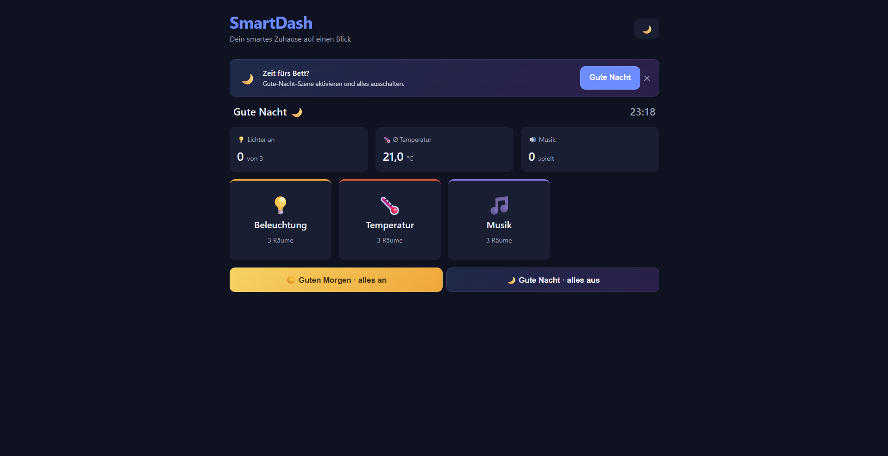
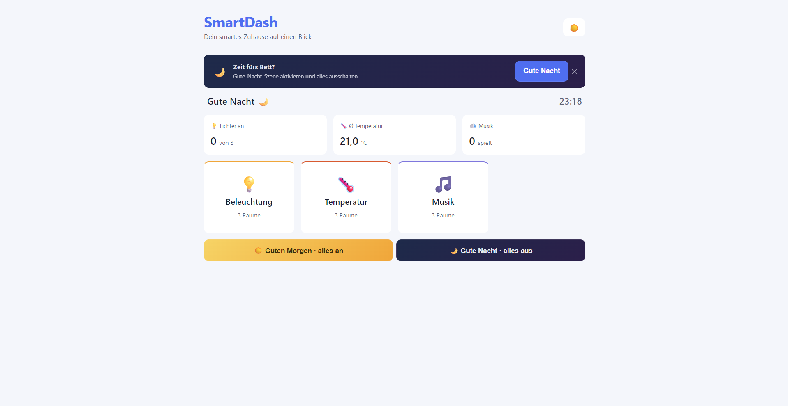

# SmartDash 🏠

An interactive smart-home dashboard built with **pure vanilla JavaScript** (ES modules) — no framework, no build step. SmartDash controls three device types by category and room, remembers every state, switches between light and dark themes, and — with staggered animations, live search, and context-aware scene suggestions — feels like a real app.

🔗 **Live demo:** [smartdash.maximilian-bese.de](https://smartdash.maximilian-bese.de)

---

## Screenshots




## Features

### Device control

- **Three device types** – lighting (on/off + dimmer), temperature (thermostat in 1 °C steps, 10–30 °C), and music (play/pause + volume slider).
- **Brightness dimmer** – a slider per light; the icon glows brighter or dimmer live as you drag.
- **Volume slider** – appears per speaker while playing and updates smoothly during dragging (without re-rendering).
- **Full CRUD** – add and remove rooms live, safeguarded by a modern confirmation dialog (Promise-based, closable with `Escape`).

### Overview & navigation

- **Two-level navigation** – category overview → click opens its rooms; back button and active highlighting.
- **Live status bar** – summarizes at a glance: how many lights are on, the average temperature (via `reduce`), and how many speakers are playing.
- **Live clock & greeting** – ticking time with a time-of-day greeting (`setInterval` + `Date`).
- **Live search** – filters rooms as you type, including a match counter, without losing keyboard focus.

### Scenes & context

- **Scene buttons** – "Good morning" (lights on + comfortable temperature) and "Good night" (everything off) orchestrate multiple systems in one click.
- **Time-based auto-suggestion** – in the evening/morning a fitting scene suggestion appears subtly; it can be dismissed and won't reappear.

### Interaction & design

- **Drag-and-drop reordering** – reorder rooms in all three categories by mouse; the order is saved and the drop target is highlighted while dragging.
- **Dark/light toggle** – switches the entire theme via CSS variables; the choice is remembered.
- **Persistence** – every piece of state (devices, order, theme) survives a reload thanks to `localStorage`.
- **Responsive card grid**, **color-coded category accents**, smooth **hover effects**, and **staggered animations** only on view changes.

## Tech stack

- **HTML5** – semantic structure
- **CSS3** – custom properties (design tokens + theme switching), Flexbox, Grid, transitions & keyframe animations, modular files via `@import`
- **JavaScript (ES modules)** – `import`/`export`, DOM rendering, event handling (including the drag-and-drop API), `map`/`filter`/`find`/`reduce`/`forEach`, `localStorage`
- **No framework, no build** – runs directly in the browser via a static web server

## Architecture

The code is strictly separated by responsibility (*separation of concerns*): the **state** holds data and its mutating functions, the **templates** are pure functions (data in, HTML out), and the **controller** assembles the view and wires up events. The state knows nothing about the UI.

```
SmartDash/
├── index.html                # entry point & scaffold
├── css/
│   ├── main.css              # aggregator (bundles all partials via @import)
│   ├── base/
│   │   ├── variables.css     # design tokens + light-theme overrides
│   │   ├── reset.css         # modern reset + base typography
│   │   ├── layout.css        # app layout & card grid
│   │   └── animations.css    # keyframes + staggered reveals
│   └── components/
│       ├── card.css          # cards, states, dimmer, drag feedback
│       ├── header.css        # headers, status bar, clock
│       ├── controls.css      # buttons, forms, search, scenes, suggestion banner
│       └── modal.css         # confirmation dialog
└── js/
    ├── main.js               # slim entry point (composition root)
    ├── state/
    │   ├── categories.js     # menu categories
    │   ├── lights.js         # lighting state + persistence
    │   ├── thermostat.js     # thermostat state + persistence
    │   ├── music.js          # music state + persistence
    │   └── view.js           # navigation / view state
    └── ui/
        ├── render.js         # controller: builds the view & wires events
        ├── templates.js      # pure rendering functions (data → HTML)
        ├── clock.js          # live clock (setInterval)
        ├── theme.js          # dark/light switching + persistence
        └── confirmDialog.js  # Promise-based confirmation dialog
```

## Technical highlights

- **Clean state/view separation** without a framework – templates are side-effect-free functions that can be tested in isolation.
- **Targeted DOM updates** for continuous events (dragging sliders, the clock, live search): only the affected element is touched instead of re-rendering everything – so focus and interaction are preserved.
- **Theming via CSS variables** – toggling a class on the `<html>` element switches the entire color scheme.
- **Drag-and-drop** using the native HTML5 API, with reorder logic via `splice` and a visual drop-target indicator.

## Local development

Since SmartDash uses ES modules, it must run over an **HTTP server** (not by double-clicking via `file://`, otherwise the browser blocks the module imports).

The easiest way is the [Live Server](https://marketplace.visualstudio.com/items?itemName=ritwickdey.LiveServer) extension in VS Code – right-click `index.html` → *Open with Live Server*.

Or with Python:

```bash
python3 -m http.server 5500
# then open http://localhost:5500
```

## License

Private portfolio project.
